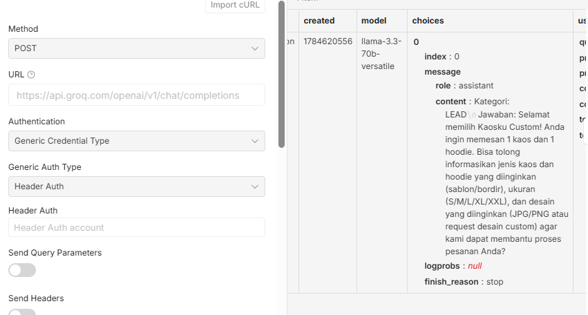
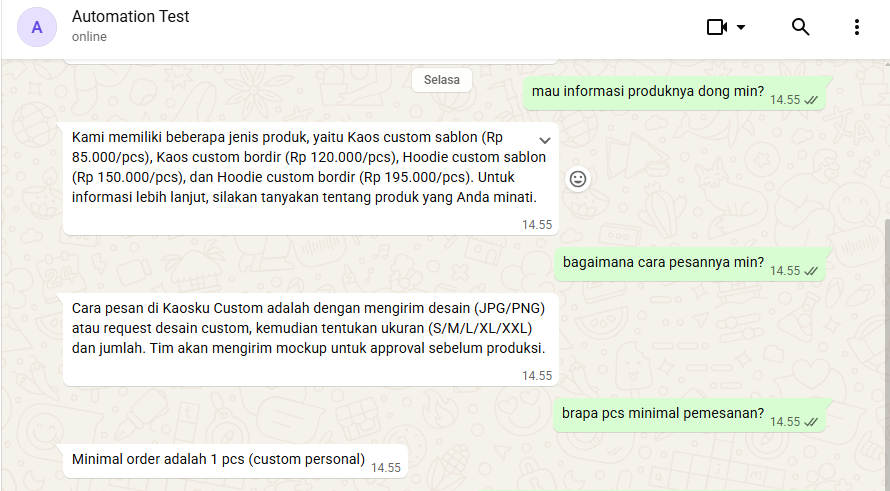
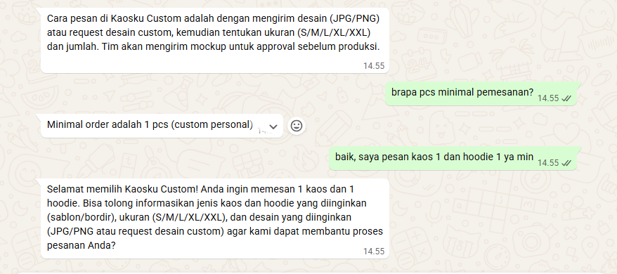
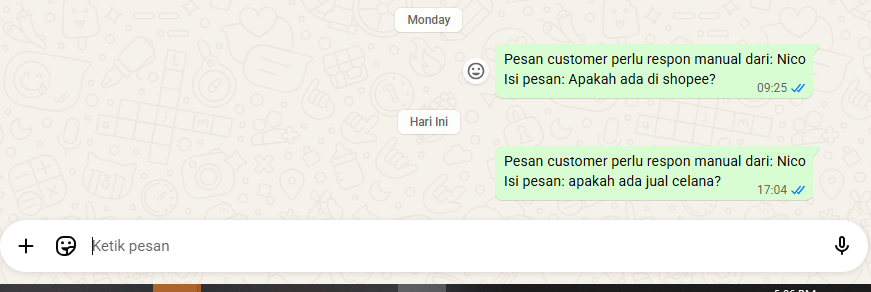
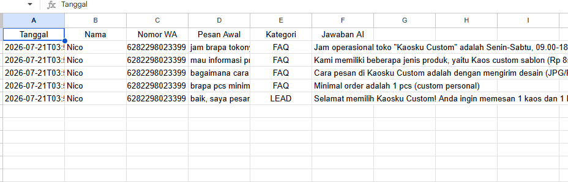
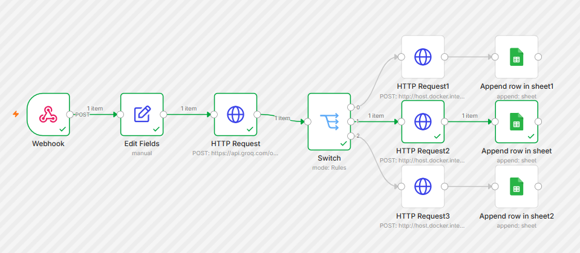

# WhatsApp AI Customer Service Automation

An automated customer service system for WhatsApp that answers FAQs 
using a business knowledge base, captures sales leads, and escalates 
out-of-scope questions to a human admin — all without manual monitoring.

🎥 **[Watch Demo Video](https://youtu.be/9S0eEsYXEBg)**

## Problem

Small businesses running customer service over WhatsApp face a constant 
trade-off: respond instantly and risk burnout, or respond slowly and 
lose potential customers. Common questions (pricing, hours, how to order) 
get asked repeatedly, while genuine leads can get buried in the same 
inbox as casual chit-chat — with no system to separate or track them.

## Solution

An end-to-end automation that:
1. Detects incoming WhatsApp messages in real-time (via WAHA)
2. Classifies each message into **FAQ**, **LEAD**, or **OTHER** using AI, 
   grounded in a custom business knowledge base
3. **FAQ** — answers immediately using verified business data (no hallucinated answers)
4. **LEAD** — replies to capture interest and asks for order details, then logs the lead
5. **OTHER** — escalates to a human admin via WhatsApp notification instead of guessing
6. Logs every interaction (category, message, AI response) to Google Sheets

## Result (based on testing)

- **Response time: ~5-10 seconds** per message, 24/7 availability — 
  no missed messages outside business hours
- **Zero hallucinated answers** — AI is restricted to the business 
  knowledge base; anything not covered is escalated to a human instead 
  of guessed
- **100% lead capture rate** — every interested customer is automatically 
  logged with contact info and initial message, no lead lost in casual chat
- **Full conversation log** — every interaction categorized and 
  searchable in Google Sheets

*Note: figures above are based on testing in a development environment. 
Actual response time may vary depending on message volume and server load.*

## Google Sheets Log

## Architecture

## Tech Stack

- **n8n** — workflow orchestration (self-hosted via Docker)
- **WAHA** (WhatsApp HTTP API) — WhatsApp connection layer (self-hosted via Docker)
- **Groq API** (Llama 3.3 70B) — AI classification & response generation
- **Google Sheets API** — interaction logging

## Knowledge Base Design

Business information (hours, pricing, policies, ordering process) is 
stored as a single configurable variable and injected into the AI prompt. 
This grounds every FAQ response in real business data instead of relying 
on the model's general knowledge — and ensures the AI escalates rather 
than fabricates when it doesn't have the answer.

## Files

- [`workflow.json`](workflow.json) — Full n8n workflow export
